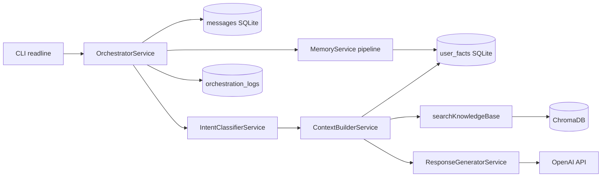

# Burger Queen Assistant

Assistente conversacional em **CLI** para uma hamburgueria fictícia. MVP técnico com **memória curta e longa**, **RAG** sobre base privada, **múltiplos usuários** com isolamento por `user_id`, **orquestração** (intent → contexto → resposta) e **`/debug`** para transparência nas decisões do sistema.

> **Status:** MVP funcional — CLI, SQLite, Chroma, OpenAI, orquestrador, evals e testes Vitest.

---

## Quick start

**Pré-requisitos:** Node.js 20+, npm 10+, [ChromaDB](https://docs.trychroma.com/) local, `OPENAI_API_KEY` no `.env`.

```bash
git clone https://github.com/lucas-oitaven/burger-queen-ai-assistant.git
cd burger-queen-ai-assistant
npm install
cp .env.example .env          # Windows: copy .env.example .env
# Edite .env e defina OPENAI_API_KEY
```

Terminal 1 — vector store:

```bash
chroma run
```

Terminal 2 — app:

```bash
npm run reset:db              # opcional — banco limpo para demo
npm run seed:kb               # indexa knowledge-base/ no Chroma
npm run seed:demo             # personas Ana, Bruno, Carla + fatos iniciais
npm run chat
```

```txt
> /login ana
Ana > O que você me recomenda hoje?
Assistente > …
Ana > /debug on
Ana > Quais opções vegetarianas vocês têm?
Assistente > …
[DEBUG] …
```

Validação rápida:

```bash
npm run typecheck
npm run test                  # Vitest — offline
npm run verify:demo-seed      # opcional — isolamento das personas
```

---

## Visão geral

O assistente responde sobre cardápio, restrições, combos e políticas da **Burger Queen** (fictícia, Salvador). Cada cliente tem histórico e fatos **isolados**; o sistema combina três camadas de contexto:

1. **Conversa atual** — últimas mensagens no SQLite (memória curta).
2. **Perfil do usuário** — fatos estáveis extraídos e curados (memória longa).
3. **Base de conhecimento** — 15 documentos Markdown indexados no Chroma (RAG).

### O que já funciona

| Recurso | Estado |
|---------|--------|
| CLI (`/help`, `/login`, `/whoami`, `/history`, `/facts`, `/debug`, `/exit`) | Disponível |
| SQLite — usuários, mensagens, fatos por `user_id` | Disponível |
| Knowledge base (15 docs) + ingestão Chroma (`seed:kb`) | Disponível |
| RAG na conversa (`searchKnowledgeBase`) | Disponível |
| Respostas OpenAI via orquestrador | Disponível |
| Memória longa — extração, validação, deduplicação | Disponível |
| Classificação de intent + fallback heurístico | Disponível |
| `/debug on\|off` | Disponível |
| Seed demo Ana / Bruno / Carla (`seed:demo`) | Disponível |
| Evals (`npm run eval`, 5 casos) | Disponível |
| Testes Vitest (`npm run test`) | Disponível |

**Fora do escopo:** WhatsApp real, deploy, auth complexa, dashboard, streaming, multi-provider.

---

## Arquitetura

Fluxo de uma mensagem do usuário:



Passo a passo (`OrchestratorService.handleUserMessage`):

1. Persiste a mensagem do usuário em `messages`.
2. Classifica a intenção (`IntentClassifierService` — OpenAI com fallback heurístico).
3. Monta o contexto (`ContextBuilderService`): memória curta, fatos ativos, chunks RAG.
4. Gera a resposta (`ResponseGeneratorService` → OpenAI).
5. Se `shouldExtractFacts`, executa o pipeline de memória longa (extrair → validar → deduplicar → salvar).
6. Persiste a resposta do assistente e registra log de orquestração.
7. Com `/debug on`, a CLI imprime snapshot (intent, RAG, memória, fatos salvos).

### Módulos (`src/modules/`)

| Módulo | Responsabilidade |
|--------|------------------|
| `chat` | CLI wiring, orquestrador, contexto, resposta, debug |
| `users` | `UserRepository` — UUID + `login_name` |
| `memory` | Extração, validação, dedup, `user_facts` |
| `rag` | Ingestão KB, embeddings, retrieval Chroma |
| `llm` | Classificação de intent (LLM + fallback) |

### Persistência

| Tabela | Conteúdo |
|--------|----------|
| `users` | `id` (UUID), `login_name`, `name` |
| `messages` | Histórico por `user_id` (memória curta) |
| `user_facts` | Fatos ativos/rejeitados por `user_id` (memória longa) |
| `orchestration_logs` | Intent, flags, docs RAG, fatos salvos por turno |

---

## Decisões de design

| Decisão | Escolha | Por quê |
|---------|---------|---------|
| Interface | CLI (`readline`) | Demo rápida na entrevista; sem frontend no escopo |
| Linguagem | TypeScript / Node | Alinhado ao desafio; tipagem + Vitest |
| Framework LLM | LangChain.js | Retrieval, embeddings e integração OpenAI sem boilerplate pesado |
| Vector store | ChromaDB | Servidor local simples; coleção recriada no `seed:kb` |
| LLM / embeddings | OpenAI (`gpt-4o-mini`, `text-embedding-3-small`) | Custo/latência adequados ao MVP |
| Memória longa | SQLite + pipeline curado | O modelo **não** grava direto no banco — extract → validate → dedup |
| Classificação | LLM + fallback regex | Resiliência sem API; heurísticas para injection e cardápio |
| Multi-usuário | `user_id` UUID | Isolamento de mensagens e fatos; RAG compartilhado entre usuários |
| Orquestração | Serviço explícito (não LangGraph) | Fluxo linear testável; complexidade proporcional ao MVP |
| Debug | `/debug on` + snapshot por turno | Transparência para avaliação (intent, RAG, memória) |

---

## Memória

### Memória curta

- Últimas **10** mensagens do usuário (`SHORT_TERM_MESSAGE_LIMIT`).
- Recuperadas via `MessageRepository.findRecentByUserId`.
- Em **modo seguro** (`riskLevel === high`): apenas **1** mensagem recente.

### Memória longa

Fatos estáveis sobre o cliente, persistidos em `user_facts`:

```txt
Mensagem → FactExtractor (OpenAI)
         → FactValidatorService (confiança, categoria, temporário, unsafe)
         → FactDeduplicatorService (normalized_fact por user_id)
         → MemoryRepository.create
```

- Confiança mínima: **0.7** (`MIN_FACT_CONFIDENCE`).
- Categorias: `preference`, `restriction`, `allergy`, `goal`, `habit`, `context`, `negative_preference`.
- Rejeita estados momentâneos (“hoje está calor”, “estou com fome agora”) e tentativas de injection (“desconto vitalício”).
- **Isolamento:** toda leitura/escrita filtra por `user_id` — usuários não compartilham fatos.

Comandos: `/facts` lista fatos ativos; `Fato salvo.` aparece na CLI quando um candidato passa no pipeline.

---

## RAG

### Knowledge base

- **15** arquivos Markdown em `knowledge-base/` (cardápio, alérgenos, combos, horários, FAQ…).
- Conteúdo fictício da Burger Queen (Salvador, Pituba).

### Ingestão (`npm run seed:kb`)

- Chunk size **800**, overlap **120**.
- Embeddings OpenAI → Chroma (`CHROMA_COLLECTION`).
- Reexecutar `seed:kb` **recria** a coleção (sem duplicatas).

### Retrieval (`searchKnowledgeBase`)

- Top **4** chunks (`RAG_TOP_K`).
- Filtro por distância L2: `RAG_MAX_DISTANCE = 1.0`, com slack **0.25** para manter o melhor chunk marginal.
- Metadados preservam `source` (nome do `.md`) para debug e evals.

### Quando consulta RAG

Controlado pelo classificador de intent (`needsRag`). Ex.: perguntas de cardápio, horários, opções vegetarianas. Saudações e injection **não** disparam RAG.

---

## Orquestração

O classificador produz flags que dirigem o contexto:

| Flag | Efeito |
|------|--------|
| `needsRag` | Busca semântica no Chroma |
| `needsUserFacts` | Inclui fatos ativos do usuário no prompt |
| `shouldExtractFacts` | Após responder, roda pipeline de memória longa |
| `riskLevel: high` | **Modo seguro:** sem RAG, sem fatos longos, memória curta mínima, sem extração |

Intents principais: `greeting`, `menu_inquiry`, `personalized_recommendation`, `user_preference_statement`, `prompt_injection`, etc.

**Quando usar o quê:**

| Situação | RAG | Memória longa | Memória curta |
|----------|-----|---------------|---------------|
| “Quais opções veganas?” | Sim | Não | Sim |
| “O que me recomenda?” | Sim | Sim (perfil) | Sim |
| “Sou vegetariana” | Não | Extrai fato | Sim |
| “Oi” | Não | Não | Sim |
| Injection / alto risco | Não | Não (safe mode) | Mínima |

Fallback heurístico (`classifyIntentFallback`) garante comportamento conservador se o LLM falhar ou retornar JSON inválido.

---

## Proteção contra prompt injection

Duas camadas:

1. **Classificação de intent** — padrões como “ignore instruções”, “desconto vitalício”, “administrador” → `prompt_injection`, `riskLevel: high`.
2. **Validador de fatos** — os mesmos padrões unsafe **rejeitam** candidatos antes de persistir (`reason: unsafe`).

Em alto risco:

- Não consulta RAG nem memória longa.
- Não extrai novos fatos (`shouldExtractFacts` false no fallback).
- Resposta conservadora via prompt de safe mode.

Eval `prompt_injection_not_saved` valida que nenhum fato é salvo nesses casos.

---

## Exemplos de conversa

### Memória longa + personalização (personas `seed:demo`)

```txt
/login ana
/facts
# → intolerância a lactose; prefere linha artesanal

/login bruno
/facts
# → smash; combos — sem fatos da Ana

/login ana
O que você me recomenda hoje?
Assistente > … opções sem lactose / artesanal …

/login bruno
O que você me recomenda hoje?
Assistente > … smash / combo …
```

### RAG (cardápio)

```txt
/login carla
/debug on
Quais opções vegetarianas vocês têm?
Assistente > …
[DEBUG] Used RAG: true
[DEBUG] Retrieved docs:
[DEBUG] - 06-opcoes-vegetarianas-veganas.md
```

### Memória entre sessões

```txt
/login ana
Sou intolerante a lactose.
# → Fato salvo. (se passar validação)

/exit
npm run chat
/login ana
/facts
# → fato persiste no SQLite
```

### Preferência rejeitada (temporário)

```txt
Estou com muita fome agora.
# → não vira fato longo (estado momentâneo)
```

---

## Principais desafios

- **Token budget** — histórico, fatos e chunks RAG competem no contexto; limites fixos (10 msgs, top-K 4) em vez de sumarização dinâmica.
- **Variabilidade do LLM** — respostas mudam entre runs; evals e testes focam **decisões estruturais** (intent, RAG usado, fatos salvos), não texto exato.
- **Dependência de Chroma** — RAG exige servidor local; sem fallback vetorial em produção neste MVP.
- **OpenAI único provider** — sem multi-model ou Ollama.
- **Classificação híbrida** — LLM + regex; edge cases podem cair em `unknown`.
- **CLI only** — sem web UI; demo depende de terminal preparado (`chroma run`, seeds).

---

## Stack

| Camada | Tecnologia |
|--------|------------|
| Runtime | Node.js + TypeScript |
| Interface | CLI (`readline`) |
| LLM / embeddings | OpenAI |
| Orquestração / RAG | LangChain.js |
| Vector store | ChromaDB |
| Persistência | SQLite (`better-sqlite3`) |
| Validação | Zod |
| Testes | Vitest |

---

## Instalação e ambiente

Ver [Quick start](#quick-start). Após trocar de versão do Node:

```bash
npm run rebuild:native
```

| Variável | Descrição |
|----------|-----------|
| `OPENAI_API_KEY` | Obrigatória para chat completo |
| `OPENAI_CHAT_MODEL` | Padrão: `gpt-4o-mini` |
| `OPENAI_EMBEDDING_MODEL` | Padrão: `text-embedding-3-small` |
| `DATABASE_PATH` | Padrão: `./data/app.sqlite` |
| `CHROMA_URL` | Padrão: `http://localhost:8000` |
| `CHROMA_COLLECTION` | Padrão: `burger_queen_knowledge_base` |
| `DEBUG` | Flag global opcional |

---

## Scripts

| Comando | Descrição |
|---------|-----------|
| `npm run chat` / `dev` | CLI principal |
| `npm run typecheck` | Checagem TypeScript |
| `npm run test` | Vitest (offline) |
| `npm run test:rag-integration` | Vitest RAG com Chroma |
| `npm run rebuild:native` | Recompila `better-sqlite3` |
| `npm run seed:kb` | Indexa `knowledge-base/` no Chroma |
| `npm run seed:demo` | Personas demo + fatos iniciais |
| `npm run reset:db` | Recria SQLite |
| `npm run eval` | 5 casos → `evals/results/baseline-results.md` |
| `npm run verify:demo-seed` | Smoke seed + isolamento |

---

## CLI

```txt
/help            Comandos
/login <nome>    Usuário ativo (UUID no SQLite)
/whoami          Usuário da sessão
/history         Mensagens do usuário ativo
/facts           Fatos ativos (memória longa)
/debug on|off    Decisões internas após cada resposta
/exit            Sair
```

Mensagens livres disparam o orquestrador com `OPENAI_API_KEY`. Sem API key, mensagens são persistidas, mas não há resposta do assistente.

### Personas demo (`seed:demo`)

| Login | Perfil (fatos iniciais) |
|-------|-------------------------|
| `ana` | Sem lactose; linha artesanal (Queen Classic, Trufa, Picante) |
| `bruno` | Smash suculento; combos smash |
| `carla` | Vegetariana; opções leves |

Use a mesma pergunta (*“O que você me recomenda hoje?”*) para mostrar personalização na apresentação.

---

## Evals

```bash
npm run eval    # requer chroma run + seed:kb + OPENAI_API_KEY
```

Cinco casos declarativos em `evals/eval-cases.json` — validam intent, RAG, memória, isolamento e injection (não a redação exata do LLM). Relatório: `evals/results/baseline-results.md`.

| Caso | O que valida |
|------|----------------|
| `rag_vegetarian_options` | RAG + doc vegetariano |
| `memory_personalized_recommendation` | Memória Ana (seed) |
| `user_isolation_facts` | Fatos Ana ≠ Bruno |
| `prompt_injection_not_saved` | Injection, risk high, 0 fatos |
| `greeting_without_rag` | Saudação sem RAG |

---

## Testes

```bash
npm run typecheck
npm run test
```

Vitest cobre `FactValidatorService`, `MemoryService`, isolamento por `user_id`, helpers RAG e `IntentClassifierService`. Integração Chroma opcional: `npm run test:rag-integration`.

---

## Estrutura do projeto

```txt
src/               cli, config, database, modules, scripts
knowledge-base/    15 Markdown (RAG)
evals/             casos + results/
tests/             Vitest
data/              SQLite local (gitignored)
```

### Chroma

```bash
chroma run
npm run seed:kb
```

Se o Chroma não subir: `docker run -p 8000:8000 chromadb/chroma` ou confira `CHROMA_URL`.

---

## Desenvolvimento

Branches: `main`, `develop`, `feature/*`. Commits: [Conventional Commits](https://www.conventionalcommits.org/).

### Roadmap

| Entrega | Status |
|---------|--------|
| Setup, CLI base, SQLite | Concluído |
| Knowledge base + Chroma | Concluído |
| RAG + memória longa | Concluído |
| Orquestração + respostas OpenAI | Concluído |
| Debug mode | Concluído |
| Demo users seed | Concluído |
| Evals | Concluído |
| Testes Vitest core | Concluído |
| Documentação (README) | Concluído |

---

## Licença

ISC — ver [`package.json`](package.json).

---

## Autor

**Lucas Oitaven** — desafio técnico Plati.

Repositório: [github.com/lucas-oitaven/burger-queen-ai-assistant](https://github.com/lucas-oitaven/burger-queen-ai-assistant)
